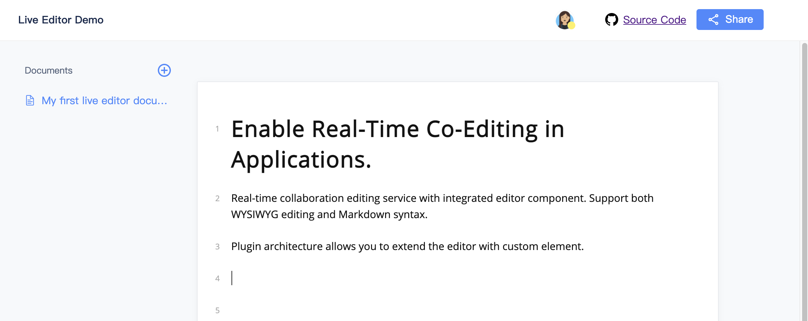

# Live Editor Demo (using https://live-editor.com as cloud service)

## Create app on https://live-editor.com

1. create an account
2. create an app
3. get appId and appSecret

## Prepare config file

```bash
cd server/config
cp default.template.js default.js
```

edit default.js

```js
module.exports = {
  appId: '', // set your app id
  appSecret: '', // set your app secret
  store: {
    use: '', // use mysql or '' (default for nedb)
    mysql: {
      host: 'localhost',
      user: 'root',
      password: 'pass',
      database: 'live-editor-demo',
      connectionLimit: 50,
      connectTimeout: 60000,
      acquireTimeout: 60000,
      waitForConnections: true,
      charset: 'utf8mb4',
    },
  },
};
```

## Run demo

Use yarn or npm

```bash
yarn
cd server
yarn
cd ../web
yarn
cd ..
yarn dev
```

## Open demo

Open http://localhost:9002 in your browser.

## preview


